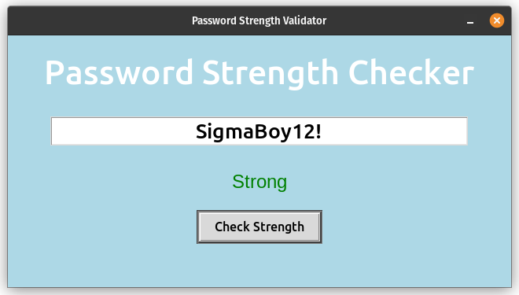

# Cyber-Security-Mini-Programs
Folder containing simple cyber security progamming exercises.

## Password-Strength-Validator
Simple program written in python in combination with tkinter for the GUI. It takes in a password inputted by a user and checks the strength based on certain criteria.

Located Here: ([Password-Strength-Tester](./Password-Strength-Validator/PasswordChecker.py))

<p align="center">
  
</p>

### Password Criteria
- Unique set of lowercase characters accounts for a point.
- Unique set of uppercase characters accounts for 2 points.
- Unique set of numbers accounts for 2 points.
- Unique set of special characters accounts for 3 points.
- For every 8 charcters in a password you get a point.
- For every diverse type of character acquire 2 points getting a potential extra 8 points.
- If the password cointains a common phrase then penalise 3 points of score with a max penatly of 20.

### Reasons For Criteria
Having unique sets of characters and diverse set of characters helps improve complexity against brute force password attacks.

### Common Password Phrases
Used a file containing 10,000 common phrases frequently found in passwords. These phrases are penalized during password evaluation, as they are vulnerable to dictionary attacks and significantly reduce password security.

### Scores
Below shows how each score is interpreted in the code.
```python
    if score < 8: return "Very Weak"
    elif score < 18: return "Weak"
    elif score < 25: return "Moderate"
    elif score < 30: return "Strong"
    else: return "Very Strong"
```
## Crypt-Socket
